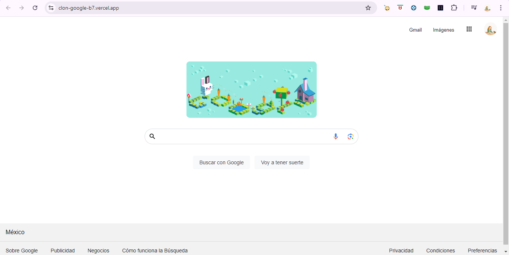

# Proyecto de la creación de un clon de Google

En este proyecto se trabaja la creacion de una página que funciones como un clon de Google, y para obtener una personalizacion se termino por modificar con un doodle.

Fue desarrollada con HTML y CSS que permite la creacion del diseño de Google.

[Proyecto Desplegado (https://clon-google-b7.vercel.app/)](https://clon-google-b7.vercel.app/)

# Presentación del sitio 

## Tecnologias 

* HTML
* CSS

Desarrollado con 💗 por [Karla](https://www.instagram.com/yan_crsl//) en [TECHNOLOCHICAS PRO](https://tecnolochicas.mx/).